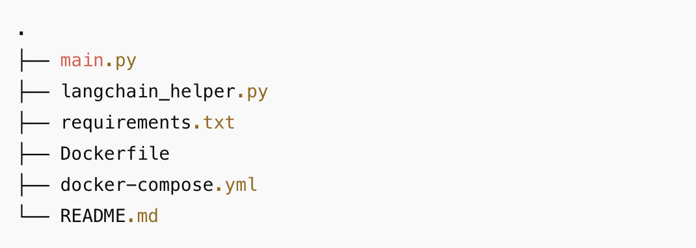
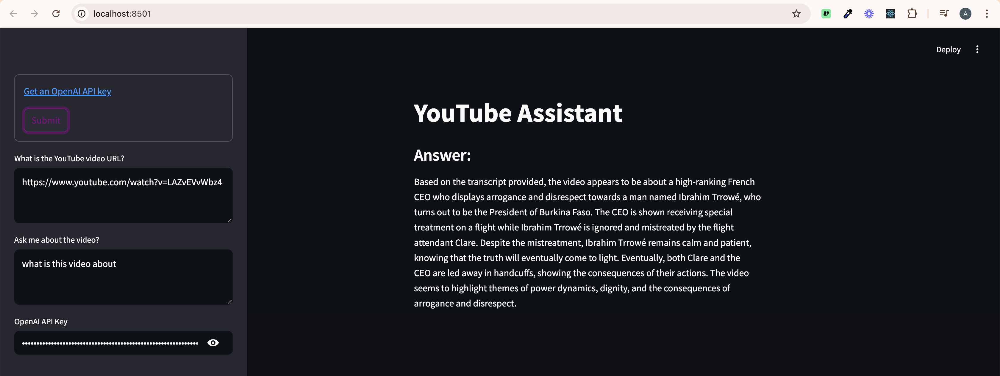

# YouTube Assistant

Ask questions about any YouTube video to this LLM powered assistant.
This project uses [streamlit](https://streamlit.io/) and [LangChain](https://www.langchain.com/)

## 🚀 Features

- Extracts and indexes YouTube video transcripts
- Uses OpenAI LLMs to answer questions about the video content
- Simple web UI built with Streamlit

### Running it locally

1. **Install the required packages:**

Create and activate a virtual environment:

```
python3 -m venv venv
source venv/bin/activate  # On Windows: venv\Scripts\activate
```

2. **Install the required packages:**

```bash
pip install -r requirements.txt
```

3. **Run the streamlit app:**

```bash
streamlit run main.py
```

### Option 2: Run with Docker Compose

Build and run the app using Docker Compose:

```
docker-compose up --build
```

Access the app in your browser:

```
http://localhost:8501
```

## 🔑 Environment Setup

To use this app, you'll need an [OpenAI API key](https://platform.openai.com/account/api-keys).
Paste it into the sidebar input when prompted.

## 🧠 Powered By

- [Streamlit](https://streamlit.io/)
- [LangChain](https://www.langchain.com/)
- [OpenAI API](https://platform.openai.com/docs)

## 🛠️ Project Structure



## 🛠️ Preview


